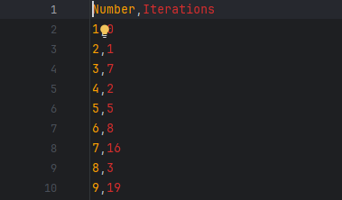

# Collatz Visualization

Collatz Visualization is a C++ project that visualizes the number of iterations required for a positive integer to reach 1, according to the [Collatz Conjecture](https://en.wikipedia.org/wiki/Collatz_conjecture). The visualization is built using ImGui and ImPlot, allowing for interactive and customizable plotting of results.

## Quick Explanation

The project calculates the Collatz sequence iterations for numbers from 1 to a defined maximum and displays the results in a scatter plot. Data points for each number and its corresponding number of iterations are computed, cached and plotted. There is also an option to export the data as a CSV file.

## Dependencies

- [ImGui](http://www.dearimgui.org/)
- [ImPlot](https://github.com/epezent/implot)
- [GLFW](https://www.glfw.org/)
- OpenGL

## Usage

1. **Install GLFW**  
   Download and extract GLFW from the [GLFW website](https://www.glfw.org/). (You may also use a package manager such as vcpkg.)

2. **Update CMake Configuration**  
   In `CMakeLists.txt`, update the `GLFW_DIR` variable to point to your GLFW installation directory.

3. **Define Maximum Number**  
   In `main.cpp`, update the `MAX_NUMBER` constant to the desired maximum number for the Collatz sequence calculation.

4. **Build and Run**  
   Build the project using CMake and run the executable. The visualization window will appear, displaying the Collatz sequence iterations for each number from 1 to the defined maximum.

## Example Images

Below are some example images of the application in action.

### Main Visualization Window with 1k Iterations

### Main Visualization Window with 1m Iterations

### CSV Export Confirmation

## Notes
The project is not yet fully optimized. For large maximum numbers the calculation takes a long time and takes up an insane amount of resources. This is a learning project and I tend to use  to learn more about computation in C++.